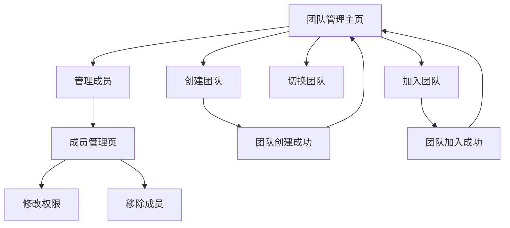

# 团队管理界面UI优化需求文档

## 1. 产品概述

本文档旨在优化ParrotKeeper应用中的团队管理界面，提升用户体验和视觉效果。通过重新设计界面布局、优化交互流程和改进视觉设计，为用户提供更加直观、高效的团队管理体验。

## 2. 核心功能

### 2.1 用户角色
| 角色 | 权限说明 | 核心功能 |
|------|----------|----------|
| 团队所有者 | 完全管理权限 | 可管理所有成员、修改团队设置、解散团队 |
| 管理员 | 部分管理权限 | 可管理普通成员、邀请新成员、查看团队数据 |
| 普通成员 | 基础使用权限 | 可查看团队信息、使用团队功能、退出团队 |

### 2.2 功能模块
团队管理界面包含以下核心页面：
1. **团队管理主页**：当前团队信息展示、团队列表、快速操作入口
2. **团队成员管理页**：成员列表、权限设置、成员操作
3. **团队创建/加入页**：创建新团队、通过邀请码加入团队

### 2.3 页面详情
| 页面名称 | 模块名称 | 功能描述 |
|----------|----------|----------|
| 团队管理主页 | 当前团队信息 | 显示当前激活团队的基本信息、成员数量、用户角色 |
| 团队管理主页 | 快速操作区 | 提供创建团队、加入团队的快速入口 |
| 团队管理主页 | 团队列表 | 展示用户所属的所有团队，支持切换、管理操作 |
| 团队成员管理页 | 成员列表 | 显示团队所有成员信息、角色、加入时间 |
| 团队成员管理页 | 权限管理 | 修改成员角色、移除成员功能 |
| 创建/加入团队 | 团队创建 | 输入团队名称、描述，创建新团队 |
| 创建/加入团队 | 团队加入 | 通过邀请码加入现有团队 |

## 3. 核心流程

### 用户操作流程
用户可以通过以下流程进行团队管理：
1. 进入团队管理页面查看当前团队状态
2. 创建新团队或加入现有团队
3. 切换不同团队进行工作
4. 管理团队成员和权限设置
5. 邀请新成员加入团队

## 4. 用户界面设计

### 4.1 设计风格
- **主色调**：#4CAF50（绿色）作为主色，#2196F3（蓝色）作为辅助色
- **按钮样式**：圆角设计（16rpx），渐变背景，阴影效果
- **字体规范**：标题32rpx加粗，正文24-28rpx，辅助信息22rpx
- **布局风格**：卡片式设计，20rpx间距，白色背景配合阴影
- **图标风格**：简洁线性图标，配合品牌色彩

### 4.2 页面设计概览

| 页面名称 | 模块名称 | UI元素 |
|----------|----------|--------|
| 团队管理主页 | 页面头部 | 居中标题，36rpx加粗字体，#333颜色 |
| 团队管理主页 | 当前团队卡片 | 绿色边框，渐变背景，突出显示当前激活状态 |
| 团队管理主页 | 快速操作按钮 | 渐变背景按钮，80rpx高度，圆角设计 |
| 团队管理主页 | 团队列表 | 白色卡片，阴影效果，角色标签彩色显示 |
| 成员管理页 | 成员卡片 | 头像+信息布局，角色标签颜色区分，操作按钮右对齐 |
| 弹窗组件 | 模态框 | 20rpx圆角，半透明遮罩，居中显示 |

### 4.3 响应式设计
- **设备适配**：主要针对移动端设计，支持不同屏幕尺寸
- **交互优化**：触摸友好的按钮尺寸，合适的点击区域
- **内容适配**：文本自动换行，图片等比缩放

## 5. UI优化改进方案

### 5.1 当前界面问题分析
1. **视觉层次不够清晰**：信息密度过高，缺乏有效的视觉分组
2. **交互反馈不足**：按钮状态变化不明显，用户操作缺乏即时反馈
3. **色彩搭配单调**：主要使用单一色彩，缺乏视觉吸引力
4. **空间利用不合理**：部分区域留白过多，部分区域过于拥挤
5. **移动端适配不佳**：按钮过小，文字可读性有待提升

### 5.2 具体优化方案

#### 5.2.1 布局优化
- **信息分层**：使用卡片式布局，明确区分不同功能区域
- **视觉引导**：通过颜色、大小、位置引导用户关注重点信息
- **空间平衡**：合理分配空间，避免信息过于密集或分散

#### 5.2.2 交互优化
- **按钮状态**：增加hover、active状态的视觉反馈
- **加载状态**：添加loading动画，提升用户等待体验
- **操作确认**：重要操作增加二次确认，防止误操作

#### 5.2.3 视觉优化
- **色彩系统**：建立完整的色彩体系，不同功能使用不同颜色
- **图标设计**：统一图标风格，增强界面识别度
- **动效设计**：适当添加过渡动画，提升界面流畅度

### 5.3 用户体验提升点

#### 5.3.1 信息展示优化
- **团队状态可视化**：通过图标、颜色直观显示团队状态
- **成员信息丰富化**：显示成员头像、在线状态、最后活跃时间
- **操作结果反馈**：每个操作都有明确的成功/失败提示

#### 5.3.2 操作流程简化
- **一键操作**：常用功能提供快捷入口，减少操作步骤
- **批量操作**：支持批量管理成员，提高管理效率
- **智能推荐**：根据用户行为推荐相关操作

#### 5.3.3 个性化定制
- **主题切换**：支持浅色/深色主题切换
- **布局调整**：允许用户自定义界面布局
- **快捷设置**：常用设置项快速访问

## 6. 技术实现要点

### 6.1 样式规范
- **颜色变量**：使用CSS变量统一管理色彩
- **尺寸标准**：建立统一的尺寸规范（间距、字体、圆角等）
- **组件化**：将通用样式抽象为可复用组件

### 6.2 动画效果
- **过渡动画**：页面切换、状态变化使用平滑过渡
- **微交互**：按钮点击、列表滑动等添加细微动效
- **性能优化**：控制动画复杂度，确保流畅运行

### 6.3 兼容性考虑
- **设备适配**：支持不同分辨率和屏幕比例
- **系统兼容**：确保在不同操作系统上显示一致
- **性能优化**：优化渲染性能，减少卡顿现象

## 7. 验收标准

### 7.1 视觉效果
- 界面整体风格统一，色彩搭配和谐
- 信息层次清晰，重点内容突出显示
- 所有交互元素都有明确的视觉反馈

### 7.2 用户体验
- 操作流程简洁直观，用户能快速完成任务
- 所有功能都有适当的提示和帮助信息
- 错误处理友好，提供明确的解决方案

### 7.3 技术指标
- 页面加载速度快，动画流畅无卡顿
- 兼容主流设备和系统版本
- 代码结构清晰，便于维护和扩展