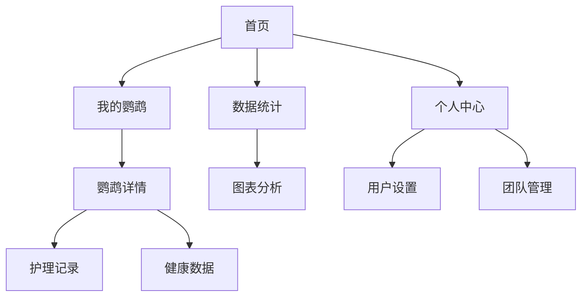

# 鹦鹉管家Web版UI对齐需求文档

## 1. 产品概述

基于现有参考APP版本，为ParrotKeeper项目创建现代化的Web版本界面，实现与参考APP完全一致的UI设计风格和用户体验。
- 主要目标：将微信小程序版本扩展为Web应用，提供跨平台的鹦鹉护理管理服务
- 目标用户：鹦鹉爱好者和专业饲养员，需要便捷的鹦鹉健康管理工具
- 产品价值：通过现代化的Web界面提供专业的鹦鹉护理数字化解决方案

## 2. 核心功能

### 2.1 用户角色

| 角色 | 注册方式 | 核心权限 |
|------|----------|----------|
| 普通用户 | 邮箱注册或第三方登录 | 管理个人鹦鹉、记录护理数据、查看统计信息 |
| 团队用户 | 邀请码加入团队 | 共享团队鹦鹉管理、协作护理记录 |

### 2.2 功能模块

我们的鹦鹉管家Web版包含以下主要页面：
1. **首页**：欢迎卡片、统计概览、快速操作面板、我的鹦鹉展示、最近活动
2. **鹦鹉列表页**：鹦鹉总览统计、详细鹦鹉卡片列表、健康状态筛选
3. **鹦鹉详情页**：个体鹦鹉信息、护理记录、健康数据、照片管理
4. **统计页面**：数据图表展示、护理趋势分析、健康报告
5. **个人中心页**：用户信息管理、设置选项、团队管理

### 2.3 页面详情

| 页面名称 | 模块名称 | 功能描述 |
|----------|----------|----------|
| 首页 | 顶部导航栏 | 显示应用标题"鹦鹉管家"、通知按钮、更多操作按钮，采用渐变背景设计 |
| 首页 | 欢迎卡片 | 个性化问候语、鹦鹉状态概览、动态背景装饰元素 |
| 首页 | 统计网格 | 四宫格展示：我的鹦鹉数量、今日喂食次数、健康状态、本月支出，带图标和颜色区分 |
| 首页 | 我的鹦鹉 | 横向滚动展示鹦鹉头像、名称、品种、健康状态标签 |
| 首页 | 快速操作 | 8个功能按钮：喂食记录、健康检查、训练计划、拍照记录、添加鹦鹉、用品购买、数据统计、护理指南 |
| 首页 | 最近活动 | 时间线展示最近的护理记录，包含图标、描述、时间戳 |
| 首页 | 底部导航栏 | 四个标签页：首页、我的鹦鹉、数据统计、个人中心，支持选中状态和页面跳转 |
| 鹦鹉列表页 | 页面头部 | 返回按钮、页面标题、添加鹦鹉按钮、更多操作 |
| 鹦鹉列表页 | 统计卡片 | 鹦鹉总数、优秀状态数量、活跃状态数量的概览展示 |
| 鹦鹉列表页 | 鹦鹉卡片 | 每只鹦鹉的详细信息卡片：头像、姓名、品种、年龄、体重、最后喂食时间、心情状态 |
| 鹦鹉详情页 | 鹦鹉信息 | 详细展示单只鹦鹉的所有信息、照片轮播、基本资料编辑 |
| 鹦鹉详情页 | 护理记录 | 喂食、清洁、健康检查等记录的时间线展示和添加功能 |
| 统计页面 | 数据图表 | 使用图表库展示护理数据趋势、健康状况分析、支出统计 |
| 个人中心页 | 用户信息 | 头像、昵称、个人设置、账户管理 |
| 个人中心页 | 功能设置 | 通知设置、语言切换、主题选择、数据导出 |

## 3. 核心流程

**普通用户流程：**
用户进入首页 → 查看鹦鹉概览和快速操作 → 点击"我的鹦鹉"查看详细列表 → 选择特定鹦鹉查看详情 → 添加护理记录 → 查看统计数据分析 → 个人中心管理设置

**团队用户流程：**
团队成员登录 → 查看共享的鹦鹉列表 → 协作添加护理记录 → 查看团队统计数据 → 团队设置管理

## 4. 用户界面设计

### 4.1 设计风格

- **主色调**：翠绿色系(emerald-400)到青色系(cyan-400)的渐变，体现自然和生机
- **辅助色**：橙色(喂食)、红色(健康)、紫色(训练)、粉色(拍照)、蓝色(添加)、黄色(购物)等功能色彩
- **按钮风格**：圆角矩形设计，支持悬停效果和微动画，采用毛玻璃效果(backdrop-blur)
- **字体**：系统默认字体栈，标题使用font-bold，正文使用font-medium，辅助信息使用font-normal
- **布局风格**：卡片式设计，大量使用圆角(rounded-2xl, rounded-3xl)，渐变背景，阴影效果
- **图标风格**：使用Remix Icon图标库，线性和填充图标结合使用

### 4.2 页面设计概览

| 页面名称 | 模块名称 | UI元素 |
|----------|----------|---------|
| 首页 | 顶部导航 | 渐变背景(from-emerald-400 via-teal-400 to-cyan-400)，白色半透明按钮，毛玻璃效果 |
| 首页 | 欢迎卡片 | 渐变背景，白色文字，装饰性圆形元素，脉冲动画状态指示器 |
| 首页 | 统计卡片 | 白色半透明背景(bg-white/80)，彩色图标，大号数字显示，悬停放大效果 |
| 首页 | 鹦鹉展示 | 圆形头像，渐变卡片背景，健康状态彩色标签，阴影效果 |
| 首页 | 快速操作 | 4x2网格布局，圆角图标，文字标签，悬停缩放效果(hover:scale-105) |
| 首页 | 最近活动 | 时间线设计，彩色功能图标，渐变背景卡片，圆点状态指示器 |
| 首页 | 底部导航 | 毛玻璃背景，选中状态高亮(text-emerald-500 bg-emerald-50)，图标+文字组合 |
| 鹦鹉列表页 | 鹦鹉卡片 | 大尺寸头像(w-20 h-20)，信息层次分明，健康和心情状态标签，右箭头指示 |

### 4.3 响应式设计

- **移动端优先**：基于375px宽度设计，向上适配到桌面端
- **触摸优化**：按钮最小点击区域44px，支持触摸手势和悬停效果
- **自适应布局**：使用Tailwind CSS的响应式类，支持sm、md、lg、xl断点
