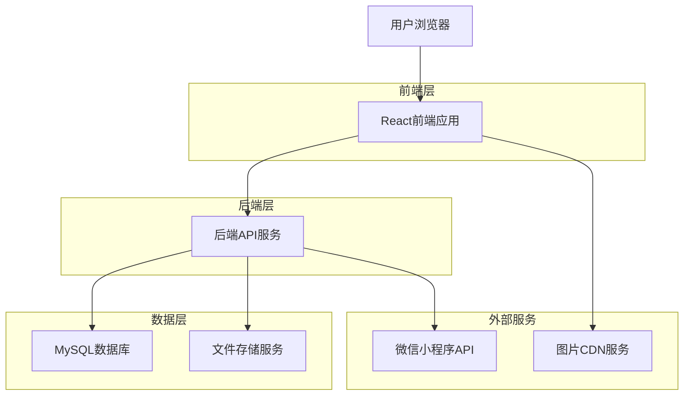
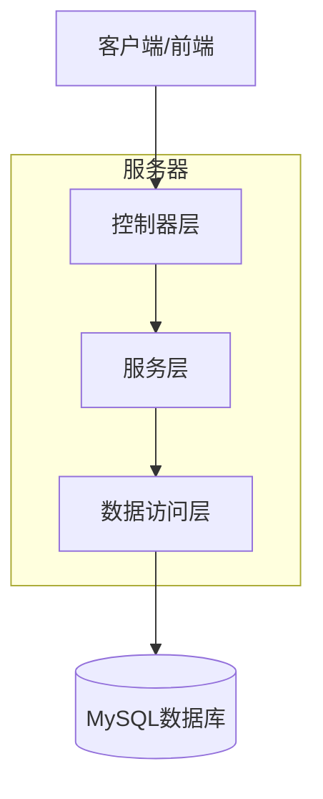
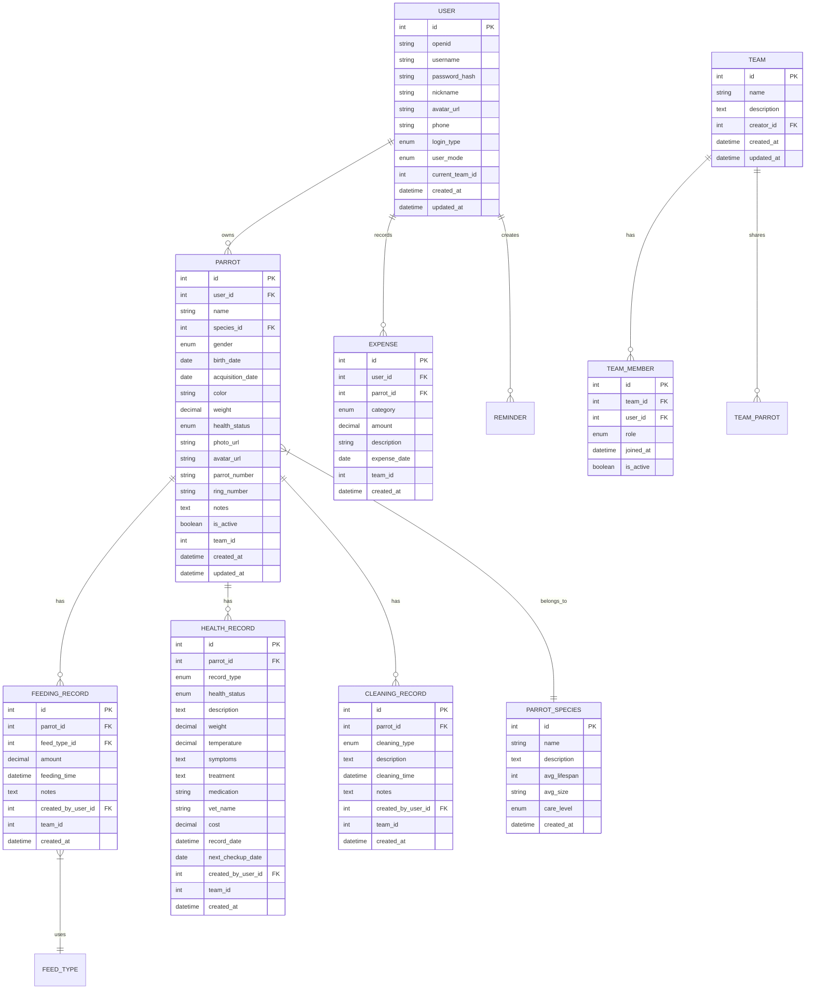

# 鹦鹉管家Web版技术架构文档

## 1. 架构设计



## 2. 技术描述

* **前端**: React\@19 + TypeScript + Vite + Tailwind CSS + React Router + i18next

* **后端**: 现有Python Flask API (<https://bimai.xyz>)

* **数据库**: MySQL (现有数据库结构)

* **图标库**: Remix Icon

* **状态管理**: React Hooks (useState, useEffect)

* **HTTP客户端**: Fetch API

## 3. 路由定义

| 路由          | 用途                       |
| ----------- | ------------------------ |
| /           | 首页，显示欢迎卡片、统计概览、快速操作和我的鹦鹉 |
| /parrots    | 鹦鹉列表页，显示所有鹦鹉的详细信息卡片      |
| /parrot/:id | 鹦鹉详情页，显示单个鹦鹉的完整信息和护理记录   |
| /statistics | 数据统计页，提供图表分析和趋势展示        |
| /profile    | 个人中心页，用户信息管理和应用设置        |
| /login      | 登录页面，支持账号密码和第三方登录        |
| /register   | 注册页面，新用户账号创建             |

## 4. API定义

### 4.1 核心API

**用户认证相关**

```
POST /api/auth/login
```

请求参数:

| 参数名      | 参数类型   | 是否必需 | 描述      |
| -------- | ------ | ---- | ------- |
| username | string | true | 用户名或手机号 |
| password | string | true | 密码      |

响应参数:

| 参数名     | 参数类型    | 描述         |
| ------- | ------- | ---------- |
| success | boolean | 请求是否成功     |
| data    | object  | 用户信息和token |
| message | string  | 响应消息       |

**鹦鹉管理相关**

```
GET /api/parrots
```

请求参数:

| 参数名       | 参数类型   | 是否必需  | 描述        |
| --------- | ------ | ----- | --------- |
| page      | number | false | 页码，默认1    |
| per\_page | number | false | 每页数量，默认20 |

响应参数:

| 参数名        | 参数类型    | 描述     |
| ---------- | ------- | ------ |
| success    | boolean | 请求是否成功 |
| data       | array   | 鹦鹉列表数据 |
| pagination | object  | 分页信息   |

```
GET /api/parrots/{id}
```

请求参数:

| 参数名 | 参数类型   | 是否必需 | 描述   |
| --- | ------ | ---- | ---- |
| id  | number | true | 鹦鹉ID |

响应参数:

| 参数名     | 参数类型    | 描述     |
| ------- | ------- | ------ |
| success | boolean | 请求是否成功 |
| data    | object  | 鹦鹉详细信息 |

**护理记录相关**

```
GET /api/records/feeding
```

请求参数:

| 参数名        | 参数类型   | 是否必需  | 描述     |
| ---------- | ------ | ----- | ------ |
| parrot\_id | number | false | 鹦鹉ID筛选 |
| page       | number | false | 页码     |
| per\_page  | number | false | 每页数量   |

**统计数据相关**

```
GET /api/statistics/feeding-trends
```

请求参数:

| 参数名        | 参数类型   | 是否必需  | 描述        |
| ---------- | ------ | ----- | --------- |
| days       | number | false | 统计天数，默认30 |
| parrot\_id | number | false | 特定鹦鹉ID    |

## 5. 服务器架构图



## 6. 数据模型

### 6.1 数据模型定义



### 6.2 数据定义语言

**用户表 (users)**

```sql
-- 用户表已存在，包含个人模式和团队模式支持
CREATE TABLE users (
    id INT PRIMARY KEY AUTO_INCREMENT,
    openid VARCHAR(100) UNIQUE,
    username VARCHAR(50) UNIQUE,
    password_hash VARCHAR(255),
    nickname VARCHAR(100),
    avatar_url VARCHAR(255),
    phone VARCHAR(20),
    login_type ENUM('wechat', 'account') DEFAULT 'wechat',
    user_mode ENUM('personal', 'team') DEFAULT 'personal',
    current_team_id INT,
    created_at DATETIME DEFAULT CURRENT_TIMESTAMP,
    updated_at DATETIME DEFAULT CURRENT_TIMESTAMP ON UPDATE CURRENT_TIMESTAMP
);
```

**鹦鹉表 (parrots)**

```sql
-- 鹦鹉表已存在，支持团队共享
CREATE TABLE parrots (
    id INT PRIMARY KEY AUTO_INCREMENT,
    user_id INT NOT NULL,
    name VARCHAR(100) NOT NULL,
    species_id INT,
    gender ENUM('male', 'female', 'unknown') DEFAULT 'unknown',
    birth_date DATE,
    acquisition_date DATE,
    color VARCHAR(100),
    weight DECIMAL(5,2),
    health_status ENUM('healthy', 'sick', 'recovering') DEFAULT 'healthy',
    photo_url VARCHAR(255),
    avatar_url VARCHAR(255),
    parrot_number VARCHAR(50),
    ring_number VARCHAR(50),
    notes TEXT,
    is_active BOOLEAN DEFAULT TRUE,
    team_id INT,
    created_at DATETIME DEFAULT CURRENT_TIMESTAMP,
    updated_at DATETIME DEFAULT CURRENT_TIMESTAMP ON UPDATE CURRENT_TIMESTAMP,
    FOREIGN KEY (user_id) REFERENCES users(id),
    FOREIGN KEY (species_id) REFERENCES parrot_species(id)
);
```

**鹦鹉品种表 (parrot\_species)**

```sql
-- 鹦鹉品种参考表
CREATE TABLE parrot_species (
    id INT PRIMARY KEY AUTO_INCREMENT,
    name VARCHAR(100) NOT NULL,
    description TEXT,
    avg_lifespan INT,
    avg_size VARCHAR(50),
    care_level ENUM('easy', 'medium', 'hard') DEFAULT 'medium',
    created_at DATETIME DEFAULT CURRENT_TIMESTAMP
);

-- 初始化品种数据
INSERT INTO parrot_species (name, description, avg_lifespan, avg_size, care_level) VALUES
('虎皮鹦鹉', '小型鹦鹉，活泼好动，适合新手饲养', 8, '18cm', 'easy'),
('玄凤鹦鹉', '中型鹦鹉，性格温和，有独特的冠羽', 15, '32cm', 'medium'),
('牡丹鹦鹉', '小型鹦鹉，色彩丰富，成对饲养更佳', 10, '15cm', 'easy'),
('蓝和尚鹦鹉', '中型鹦鹉，智商较高，需要更多关注', 20, '29cm', 'medium'),
('红腹鹦鹉', '中型鹦鹉，色彩鲜艳，需要专业护理', 25, '23cm', 'hard');
```

**喂食记录表 (feeding\_records)**

```sql
-- 喂食记录表已存在，支持团队协作
CREATE TABLE feeding_records (
    id INT PRIMARY KEY AUTO_INCREMENT,
    parrot_id INT NOT NULL,
    feed_type_id INT,
    amount DECIMAL(6,2),
    feeding_time DATETIME DEFAULT CURRENT_TIMESTAMP,
    notes TEXT,
    created_by_user_id INT NOT NULL,
    team_id INT,
    created_at DATETIME DEFAULT CURRENT_TIMESTAMP,
    FOREIGN KEY (parrot_id) REFERENCES parrots(id),
    FOREIGN KEY (feed_type_id) REFERENCES feed_types(id),
    FOREIGN KEY (created_by_user_id) REFERENCES users(id)
);
```

**团队表 (teams)**

```sql
-- 团队管理表
CREATE TABLE teams (
    id INT PRIMARY KEY AUTO_INCREMENT,
    name VARCHAR(100) NOT NULL,
    description TEXT,
    creator_id INT NOT NULL,
    created_at DATETIME DEFAULT CURRENT_TIMESTAMP,
    updated_at DATETIME DEFAULT CURRENT_TIMESTAMP ON UPDATE CURRENT_TIMESTAMP,
    FOREIGN KEY (creator_id) REFERENCES users(id)
);
```

